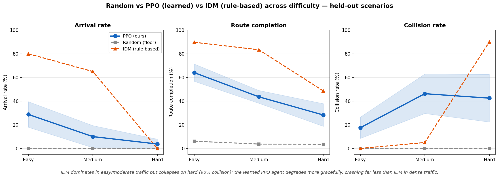
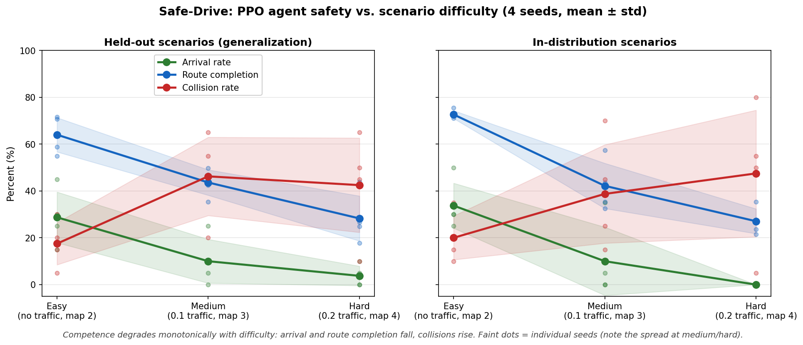

# safe-drive

**Distributed reinforcement learning for autonomous driving, with verification-grade safety evaluation.**

A PPO agent trained from scratch to drive in the [MetaDrive](https://github.com/metadriverse/metadrive) simulator, using a difficulty curriculum across multiple parallel seeds — and, more importantly, evaluated the way an ADAS verification engineer evaluates a real driver-assistance system: collision rate, arrival rate, route completion, generalization to unseen maps, and comparison against a floor and a classical baseline.

The point of this project is not a superhuman agent. It is a correct, reproducible RL system and an *honest, rigorous characterization* of what a learned driving policy can and cannot do under a fixed compute budget — including where it beats a hand-engineered controller and where it loses.

---

## Headline result

The agent was trained through a three-stage curriculum (easy → medium → hard) and evaluated against two baselines — a random-action floor and MetaDrive's built-in rule-based IDM driver — across all three difficulties, on both training-distribution and held-out (unseen) scenarios, over four seeds.



**The finding worth stating plainly:** the rule-based IDM controller dominates in easy and moderate traffic, but **collapses in dense traffic — 90% collision rate on the hard setting.** The learned PPO agent is weaker in absolute terms everywhere, but **degrades far more gracefully: it crashes ~43% of the time on hard versus IDM's 90%.** Learned control traded peak performance for robustness to conditions outside the comfort zone of a simple car-following model. That trade-off — not a leaderboard number — is the result.

Per-difficulty, held-out (mean across 4 seeds):

| Difficulty | Policy | Arrival | Collision | Route completion |
|---|---|---|---|---|
| Easy   | Random | 0%  | 0%  | 6%  |
| Easy   | **PPO (ours)** | **29%** | **18%** | **64%** |
| Easy   | IDM    | 80% | 0%  | 90% |
| Medium | Random | 0%  | 0%  | 4%  |
| Medium | **PPO (ours)** | **10%** | **46%** | **44%** |
| Medium | IDM    | 65% | 5%  | 83% |
| Hard   | Random | 0%  | 0%  | 3%  |
| Hard   | **PPO (ours)** | **4%**  | **43%** | **28%** |
| Hard   | IDM    | 0%  | 90% | 49% |

The agent's own competence curve across difficulty, with per-seed spread:



Competence degrades monotonically with difficulty, and the seeds cluster tightly on easy but diverge on medium/hard — some converge cautious (low collision, low progress), some reckless. That instability at high difficulty is itself a documented finding.

---

## What this is, concretely

The agent is a neural network that, given a 259-dimensional observation (ego state, navigation, and a lidar ring), outputs a 2-dimensional continuous action `[steering, acceleration]`. It is trained purely by trial and error — no demonstrations — to maximize a reward shaped for goal-reaching while penalizing collisions and leaving the road.

- **Algorithm:** PPO (Proximal Policy Optimization), implemented from scratch (CleanRL-style, single-file, no RL framework).
- **Simulator:** MetaDrive 0.4.3 — procedurally generated roads and traffic.
- **Scale:** parallel-rollout collection (16 environments per seed) × 4 independent seeds, one per GPU, ~15M steps per seed.
- **Differentiator:** a safety-evaluation harness that reports verification-grade KPIs rather than just training reward.

---

## Method

### Reward design

Reward shaping was the single most decisive factor. An early reward with a weak crash penalty produced an agent that earned net-positive reward *while crashing* (the progress reward outweighed the −15 crash penalty), so "rush and crash" was a winning strategy and arrival rate sat at 0%. The redesigned reward (`reward:` block in `configs/ppo.yaml`, applied in `envs/driving_env.py`) makes safety penalties dominate:

- crash: −80, out-of-road: −40 (sized to exceed the progress reward earned before failure)
- arrival: +200 (the dominant payoff)
- terminal completion bonus: +50 × route-completion (pulls toward the goal with no perverse early-exit incentive)

These are config-driven so the validation loop is a YAML edit, not a code change.

### Curriculum

A fresh policy thrown at full difficulty crashed ~80% and never arrived. The same reward in an *easy* setting (no traffic, short maps) reached goals within 2M steps. So training is staged (`curriculum.py`): the agent masters goal-reaching on easy roads first, then traffic and map complexity are ramped in. Each stage resumes from the previous stage's checkpoint, carrying network weights *and* optimizer state forward.

### Distributed training

`sweep.py` launches one curriculum per GPU, pinned via `CUDA_VISIBLE_DEVICES`, with each seed checkpointing independently and resuming on interruption (Spot-safe). The workload is CPU-bound — MetaDrive physics runs on CPU and the policy net is tiny — so the four T4 GPUs sit near-idle while 64 environment processes saturate the cores.

---

## Engineering notes: the bug hunt

RL fails silently — a broken implementation still produces a learning curve. Several real bugs were found and fixed, each documented in code comments:

- **Cross-environment GAE corruption (high severity):** advantage estimation flattened the `(T, N)` rollout to `(T·N,)` and bootstrapped each step from the *next environment* at the same timestep instead of the next timestep of the *same* environment. Silently wrong advantages. Fixed to compute per-env along the time axis; locked in by `tests/test_gae.py`.
- **Reward hacking:** the weak crash penalty described above.
- **Entropy collapse:** an unclamped policy log-std let entropy *grow* over training (2.8 → 6.3) — the policy got more random, not less. Clamped to `[-5, 0.5]`.
- **Infrastructure:** a hardcoded GPU count once launched 8 processes on a 4-GPU box, with 4 seeds silently falling back to CPU and running 24+ hours unnoticed; per-seed checkpoints (seeds had been overwriting one shared path); MetaDrive's Panda3D per-process singleton constraint (one env per process → `AsyncVectorEnv`).

---

## Evaluation

`eval/safety_eval.py` reports, on both training-distribution and held-out scenario pools:

- **Collision rate**, **arrival (success) rate**, **route completion** — from MetaDrive's ground-truth episode outcomes.
- **Generalization gap** — train vs held-out route completion.
- A coarse time-to-collision proxy (labelled approximate; the ground-truth outcome metrics are authoritative).

`eval/baselines.py` scores a random policy and the IDM rule-based driver on the identical KPIs, giving every number a floor and a classical reference.

---

## Honest limitations

- **The agent is not good in absolute terms.** It reaches goals ~29% of the time on easy and ~4% on hard. It is competent relative to a random floor and degrades more gracefully than IDM, but a hand-engineered controller outperforms it in easy/moderate conditions.
- **High seed variance at difficulty.** At medium/hard the four seeds converge to qualitatively different policies (cautious vs reckless). Training is unstable in this regime.
- **Fixed budget.** Training was capped at ~15M steps/seed under a hard cloud-cost limit. Stronger results would likely need substantially more steps, a gentler curriculum, and reward tuning specific to the dense-traffic regime — none of which were pursued, by choice.
- **20 episodes per condition** gives noisy per-seed estimates; aggregate (80 episodes) figures are more reliable than any single cell.

---

## Reproduce

```bash
# environment (Python 3.10)
pip install -r requirements.txt

# quick local smoke test (1 env, 10k steps, no GPU)
python train.py --test

# full curriculum, 4 seeds, one per GPU
python sweep.py --curriculum

# evaluate a trained seed at a given difficulty
python eval/safety_eval.py --checkpoint checkpoints/seed_1/ppo_final.pt --traffic-density 0.0 --map 2

# baselines
python eval/baselines.py --policy random --traffic-density 0.2 --map 4
python eval/baselines.py --policy idm    --traffic-density 0.2 --map 4

# regenerate the figures
python analysis/make_plots.py

# tests
python -m pytest tests/ -q
```

Or via Docker (reproducible CPU environment):

```bash
docker build -t safe-drive .
docker run --rm safe-drive                       # runs the test suite
docker run --rm safe-drive python train.py --test
```

---

## Deployment

The trained policy exports to a standalone TorchScript file — inference decoupled from all training code (no PPO, no sampling, no project imports):

```bash
python export/export_torchscript.py --checkpoint checkpoints/seed_1/ppo_final.pt --out results/policy_seed1.ts.pt
```

```python
import torch
policy = torch.jit.load("results/policy_seed1.ts.pt")
action = policy(obs)          # obs: (batch, 259) float32  ->  (batch, 2) in [-1, 1]
```

A short top-down clip of the flagship seed driving:

```bash
python demo/render_demo.py --checkpoint checkpoints/seed_1/ppo_final.pt
```

---

## Repository structure

```
train.py              PPO training entrypoint (curriculum-aware, resumable)
curriculum.py         easy -> medium -> hard orchestrator (one seed)
sweep.py              parallel multi-seed launcher (one curriculum per GPU)
ppo/ppo.py            ActorCritic network + PPO agent (GAE, clip objective)
envs/driving_env.py   MetaDrive Gymnasium wrapper + config-driven reward
configs/ppo.yaml      hyperparameters + reward weights
eval/safety_eval.py   safety-KPI evaluation harness
eval/baselines.py     random + IDM baselines on the same KPIs
analysis/make_plots.py results figures
export/export_torchscript.py   deployment export
demo/render_demo.py   top-down clip of a trained policy
tests/                pytest suite (reward shaping, GAE correctness)
```

See `MODEL_CARD.md` for the trained-model details, intended use, and limitations.